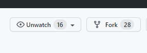
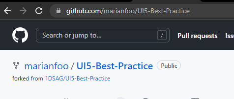
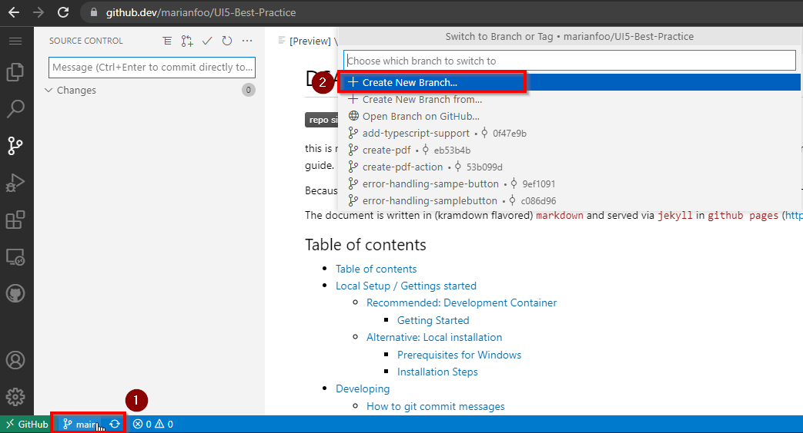
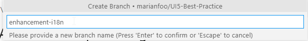
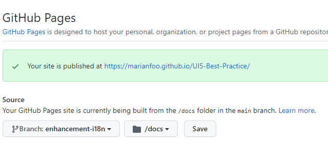

# DSAG's UI5 best practice guide


this is not the guide itself (it's over at <https://1dsag.github.io/UI5-Best-Practice/>), but the corresponding repository with instructions on how to contribute to the guide.

Because **the DSAG UI5 best practice guide is a living document** 👨‍💻 - thriving on and with its' community 🥳

The document is written in (kramdown flavored) `markdown` and served via `jekyll` in `github pages` (<https://1dsag.github.io/UI5-Best-Practice/>).

## Table of contents
* [Table of contents](#table-of-contents)
* [Getting started Options](#getting-started)
  * [Recommended: Development Container](#recommended-development-container)
    * [Installation Steps](#installation-steps)
  * [Alternative:  Local installation](#alternative--local-installation)
    * [Prerequisites for Windows](#prerequisites-for-windows)
    * [Installation Steps](#installation-steps)
* [Contributing](#contributing)
* [Licensing](#licensing)

## Getting started Options

### **Quick Start with GitHub web-based editor**

The [web-based editor is as IDE](https://docs.github.com/en/codespaces/the-githubdev-web-based-editor) that runs entirely in your browser. With the web-based editor, you can navigate files and source code repositories from GitHub, and make and commit code changes. You can open any repository, fork, or pull request in the editor.  
Also you can preview markdown files while you edit.  
This makes it very easy to get started since no local installation is required.  
You can't see the final result right away, but GitHub can generate that as well for you.  

1. Fork Repo



2. Go to your created Fork Page



3.  Press just `.` on your keyboard to switch to the IDE

4. Create new Branch



5. Define Branch Name



6. Start writing

Under `/docs` is the documentation. Just start editing or create a new folder for a new topic

7. Preview Site

You can preview the site also within GitHub.  
Just go to Settings in your repository and there to Pages.  
The link would be https://github.com/YOURUSERNAME/UI5-Best-Practice/settings/pages  
Choose here your branch you´re working on and choose the `docs` folder.  
After you have saved, it takes a few minutes until the page is accessible under the given URL.
From then on, the page is rebuilt with every commit.



### **Development Docker Container**

This is the easiest way to have your development environment ready in no time.
You get a ready to use configured Debian Container which is transparently used by Visual Studio Code.

#### Installation Steps

Install the following programs:

* [Visual Studio Code](https://code.visualstudio.com/)
* [Remote Containers Extension](https://marketplace.visualstudio.com/items?itemName=ms-vscode-remote.remote-containers)
* [Docker](https://code.visualstudio.com/docs/remote/containers)

Clone the repository with the command _[Remote-Containers: Clone Repository in Container Volume...](https://code.visualstudio.com/docs/remote/containers-advanced#_use-clone-repository-in-container-volume)_

This will

* Clone the Repository in a Container Volume
* Build the Docker Image
* Start the Docker Container and map the required ports
* Mount the created Container Volume
* Install the required npm packages
* Install the required ruby gems

The only thing left to do is open the console in Visual Studio Code (it is attached to the running Development Container), navigate into the docs folder and start the Development Server:

```shell
cd docs
bundle exec jekyll serve --livereload
```

### **Local installation**

#### Prerequisites for Windows

* Install <https://chocolatey.org/>
* Install MSYS2 `choco install msys2` <https://chocolatey.org/packages/msys2>
* Install Ruby `choco install ruby` <https://chocolatey.org/packages/ruby>
* Update Build Toolchain `ridk install 3`
* see setup local github pages site 😉

#### Installation Steps

* make sure, `ruby` 2.7 is installed on your system
* clone the repo
* switch to the document base
  `$> cd docs`
* `$> bundle install`  
  for installing the `github-pages` jekyll incarnation
* start the local gh-pages instance, including automatic browser live-reload

  ```shell
  bundle exec jekyll serve --livereload
  Configuration file: /Users/you/UI5-Best-Practice/docs/_config.yml
              Source: /Users/you/UI5-Best-Practice/docs
         Destination: /Users/you/UI5-Best-Practice/docs/_site
   Incremental build: disabled. Enable with --incremental
        Generating...
         Jekyll Feed: Generating feed for posts
                      done in 0.233 seconds.
   Auto-regeneration: enabled for '/Users/you/UI5-Best-Practice/docs'
   LiveReload address: http://127.0.0.1:35729
      Server address: http://127.0.0.1:4000/
    Server running... press ctrl-c to stop.
  ```

* point your web browser to <http://localhost:4000>

## Contributing

For all information on the development process and best practices for creating content, visit [Contributing](contributing.md).

## Licensing

This project uses the CC BY 4.0 license : [LICENSE](LICENSE)
