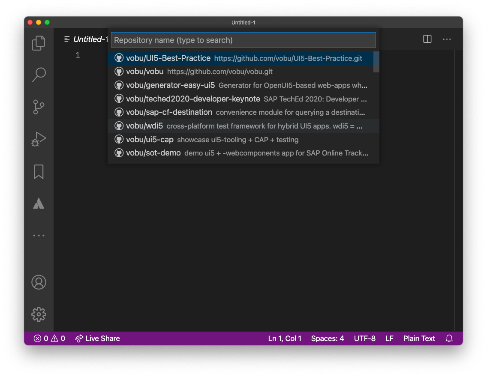

# DSAG's UI5 best practice guide

this is not the guide itself (it's over at <https://1dsag.github.io/UI5-Best-Practice/>), but the corresponding repository with instructions on how to contribute to the guide.

Because **the DSAG UI5 best practice guide is a living document** 👨‍💻 - thriving on and with its' community 🥳

The document is written in (github flavored) `markdown` and served via `jekyll` in `github pages` (<https://1dsag.github.io/UI5-Best-Practice/>). So the recommended contribution approach is to

- fork the repo + create new branch locally
- run the guide locally (`bundle exec jekyll serve`).  
  write, edit, code (most likely in `/docs/**/*`).  
  repeat.
- push local branch to your fork, create a PR, assign a reviewer
- 🙌

You'll find more detailed instructions on each of the above below.

<!--ts-->
- [DSAG's UI5 best practice guide](#dsags-ui5-best-practice-guide)
  - [setup local github pages site](#setup-local-github-pages-site)
  - [linting of markdown content](#linting-of-markdown-content)
  - [git commit messages](#git-commit-messages)
  - [example PR-based workflow](#example-pr-based-workflow)

<!-- Added by: runner, at: Mon Jan 11 15:27:45 UTC 2021 -->

<!--te-->

## setup local github pages site

### Development Container

This is the easiest way to have your development environment ready in no time.
You get a ready to use configured Debian Container which is transparently used by Visual Studio Code.

#### Getting Started

Install the following programs:

- [Visual Studio Code](https://code.visualstudio.com/)
- [Remote Containers Extension](https://marketplace.visualstudio.com/items?itemName=ms-vscode-remote.remote-containers)
- [Docker](https://code.visualstudio.com/docs/remote/containers)

Clone the repository with the command _[Remote-Containers: Clone Repository in Container Volume...](https://code.visualstudio.com/docs/remote/containers-advanced#_use-clone-repository-in-container-volume)_

This will

- Clone the Repository in a Container Volume
- Build the Docker Image
- Start the Docker Container and map the required ports
- Mount the created Container Volume
- Install the required npm packages
- Install the required ruby gems

The only thing left to do is open the console in Visual Studio Code (it is attached to the running Development Container), navigate into the docs folder and start the Development Server:

```shell
cd docs
bundle exec jekyll serve --livereload
```

### local installation

- make sure, `ruby` 2.7 is installed on your system
- clone the repo
- switch to the document base
  `$> cd docs`
- `$> bundle install`  
  for installing the `github-pages` jekyll incarnation
- start the local gh-pages instance, including automatic browser live-reload

  ```shell
  bundle exec jekyll serve --livereload
  Configuration file: /Users/you/UI5-Best-Practice/docs/_config.yml
              Source: /Users/you/UI5-Best-Practice/docs
         Destination: /Users/you/UI5-Best-Practice/docs/_site
   Incremental build: disabled. Enable with --incremental
        Generating...
         Jekyll Feed: Generating feed for posts
                      done in 0.233 seconds.
   Auto-regeneration: enabled for '/Users/you/UI5-Best-Practice/docs'
   LiveReload address: http://127.0.0.1:35729
      Server address: http://127.0.0.1:4000/
    Server running... press ctrl-c to stop.
  ```

- point your web browser to <http://localhost:4000>

### Prerequisite for Win10 PC

- Install <https://chocolatey.org/>
- Install MSYS2 `choco install msys2` <https://chocolatey.org/packages/msys2>
- Install Ruby `choco install ruby` <https://chocolatey.org/packages/ruby>
- Update Build Toolchain `ridk install 3`
- see setup local github pages site 😉

## linting of markdown content

Any markdown content (in `/docs/**/*`) is linted via [`markdownlint`](https://github.com/DavidAnson/markdownlint) both for quality assurance and convenience.  
For quality assurance, to have the markdown-files max standard compliant, so subsequent processing and exporting is possible without running into formatting issues.  
For convenience, because small markdown formatting mistakes are automatically fixed via the `markdownlint` upon commit - the `markdownlint` [`cli`](https://github.com/igorshubovych/markdownlint-cli) injects those fixes prior to the git commit, so don’t be surprised 😉

## git commit messages

commit messages are linted in order to allow for automatic later processing into `CHANGELOG` et al documents.  
The linting occurs against the standards defined in the ["conventional commit" guidelines](https://github.com/conventional-changelog/commitlint/tree/master/%40commitlint/config-conventional), based on [the Angular project ones](https://github.com/angular/angular/blob/22b96b9/CONTRIBUTING.md#-commit-message-guidelines).

The structure of a "conventional commit" message looks like:

```text
<type>[optional scope]: <description>

[optional body]

[optional footer(s)]
```

`<type>` can be any of

- build
- ci
- chore
- docs
- feat
- fix
- perf
- refactor
- revert
- style
- test

So a minimal commit message could look like...

`feat: added basic testing chapter`

…while a maxed out one might look like:

```text
fix: correct minor typos in code

see the issue for details on typos fixed.
additionally, replaced the dreaded ortho-""
with straight/standard ones.

Reviewed-by: Z
Closes #133
```

Please refer to the [conventional commits website](https://www.conventionalcommits.org) for more details on all the possibilities of formatting a git commit message.

## example PR-based workflow

0. fork the repo  
   

1. clone your fork into your local development environment  
   

2. create a new local git branch  
   

3. write, edit, code (most likely `markdown` content in `/docs/**/*`.  
   👨‍💻  
   repeat.

   > note: we're using [`github flavoured markdown` (gfm)](https://github.github.com/gfm/) that allows for extended markdown formatting

   `git commit` early, `git commit` often  
   &rarr; watch out for the commit linting (see [git commit messages](#git-commit-messages))  
   &rarr; enjoy the convenience of auto-markdown-linting (see [linting of markdown content](#linting-of-markdown-content))

4. if applicable, [clean up your git commit history](https://about.gitlab.com/blog/2018/06/07/keeping-git-commit-history-clean/#situation-3-i-need-to-add-remove-or-combine-commits)

5. push the local branch to your fork

6. submit a pull request (PR)  
   

7. write the PR message similar to the [git commit messages](#git-commit-messages), so `squash`-merging gets easy for the maintainers  
   
   if applicable, referenc open issues in your commit message (<https://docs.github.com/en/free-pro-team@latest/github/managing-your-work-on-github/linking-a-pull-request-to-an-issue#linking-a-pull-request-to-an-issue-using-a-keyword>)

8. add a reviewer to the PR  
   

9. Changes necessary after the PR was created?  
   Simply commit to the branch of your fork  
   &rarr; the PR gets updated automatically  
   &rarr; move the PR into `draft` mode until ready (then move to `ready for review`)

10. PR review process successfully completed?  
    Then the PR will be merged by any of the maintainers and it’s time for 🎉
