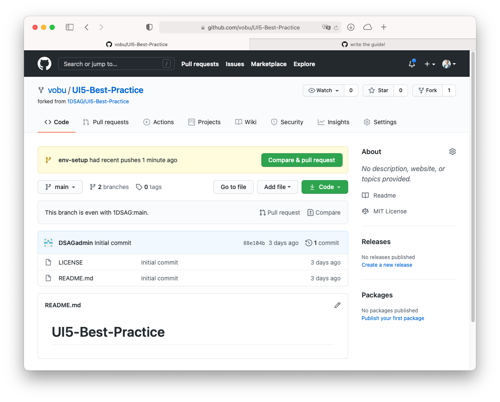

## Table of contents

* [Developing](#developing)
  * [How to git commit messages](#how-to-git-commit-messages)
* [Contributing](#contributing)
  * [How to use Pull Requests in GitHub](#how-to-use-pull-requests-in-github)
  * [linting of markdown content](#linting-of-markdown-content)
* [Licensing](#licensing)

## Developing

### How to git commit messages

commit messages are linted in order to allow for automatic later processing into `CHANGELOG` et al documents.  
The linting occurs against the standards defined in the ["conventional commit" guidelines](https://github.com/conventional-changelog/commitlint/tree/master/%40commitlint/config-conventional), based on [the Angular project ones](https://github.com/angular/angular/blob/22b96b9/CONTRIBUTING.md#-commit-message-guidelines).

The structure of a "conventional commit" message looks like:

```text
<type>[optional scope]: <description>

[optional body]

[optional footer(s)]
```

`<type>` can be any of

* build
* ci
* chore
* docs
* feat
* fix
* perf
* refactor
* revert
* style
* test

So a minimal commit message could look like...

`feat: added basic testing chapter`

…while a maxed out one might look like:

```text
fix: correct minor typos in code

see the issue for details on typos fixed.
additionally, replaced the dreaded ortho-""
with straight/standard ones.

Reviewed-by: Z
Closes #133
```

Please refer to the [conventional commits website](https://www.conventionalcommits.org) for more details on all the possibilities of formatting a git commit message.

## Contributing

### How to use Pull Requests in GitHub

0. fork the repo  
   

1. clone your fork into your local development environment  
   

2. create a new local git branch  
   

3. write, edit, code (most likely `markdown` content in `/docs/**/*`.  
   👨‍💻  
   repeat.

   > note: we're using [`github flavoured markdown` (gfm)](https://github.github.com/gfm/) that allows for extended markdown formatting

   `git commit` early, `git commit` often  
   &rarr; watch out for the commit linting (see [git commit messages](#git-commit-messages))  
   &rarr; enjoy the convenience of auto-markdown-linting (see [linting of markdown content](#linting-of-markdown-content))

4. if applicable, [clean up your git commit history](https://about.gitlab.com/blog/2018/06/07/keeping-git-commit-history-clean/#situation-3-i-need-to-add-remove-or-combine-commits)

5. push the local branch to your fork

6. submit a pull request (PR)  
   

7. write the PR message similar to the [git commit messages](#git-commit-messages), so `squash`-merging gets easy for the maintainers  
   
   if applicable, referenc open issues in your commit message (<https://docs.github.com/en/free-pro-team@latest/github/managing-your-work-on-github/linking-a-pull-request-to-an-issue#linking-a-pull-request-to-an-issue-using-a-keyword>)

8. add a reviewer to the PR  
   

9. Changes necessary after the PR was created?  
   Simply commit to the branch of your fork  
   &rarr; the PR gets updated automatically  
   &rarr; move the PR into `draft` mode until ready (then move to `ready for review`)

10. PR review process successfully completed?  
    Then the PR will be merged by any of the maintainers and it’s time for 🎉

### linting of markdown content

Any markdown content (in `/docs/**/*`) is linted via [`markdownlint`](https://github.com/DavidAnson/markdownlint) both for quality assurance and convenience.  
For quality assurance, to have the markdown-files max standard compliant, so subsequent processing and exporting is possible without running into formatting issues.  
For convenience, because small markdown formatting mistakes are automatically fixed via the `markdownlint` upon commit - the `markdownlint` [`cli`](https://github.com/igorshubovych/markdownlint-cli) injects those fixes prior to the git commit, so don’t be surprised 😉
