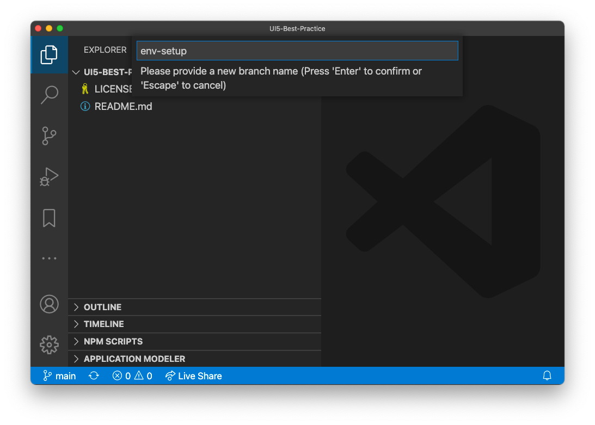
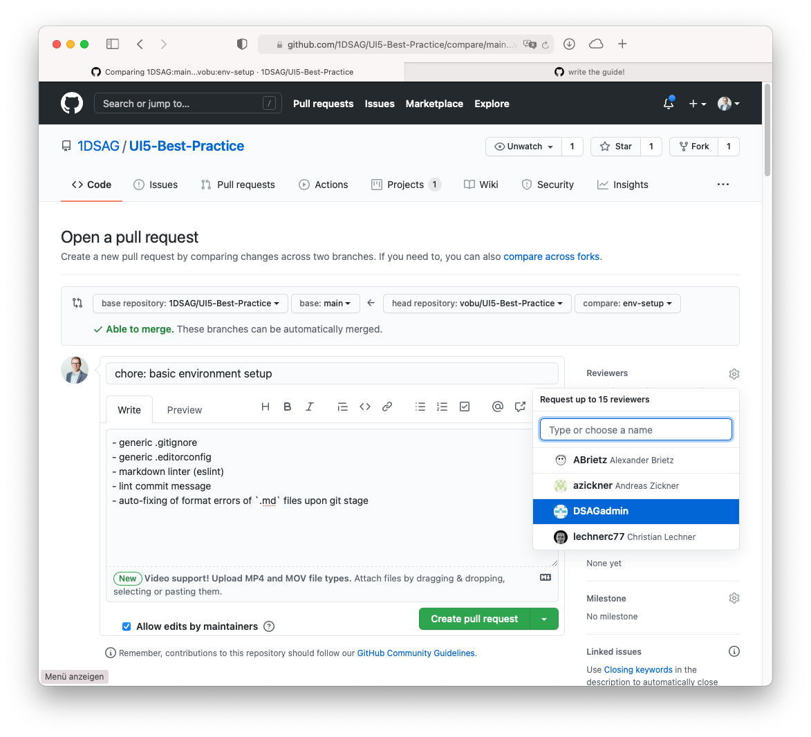

# Table of contents

- [Table of contents](#table-of-contents)
  - [Create Content](#create-content)
    - [Create new Topic](#create-new-topic)
      - [Create new folder](#create-new-folder)
      - [Metadata in pages](#metadata-in-pages)
    - [Add Images](#add-images)
    - [Create sample app](#create-sample-app)
    - [Add Emojis](#add-emojis)
  - [Developing](#developing)
    - [How to git commit messages](#how-to-git-commit-messages)
  - [Contributing](#contributing)
    - [How to use Pull Requests in GitHub](#how-to-use-pull-requests-in-github)
    - [Markdown Linting](#markdown-linting)
    - [General Linting](#general-linting)

## Create Content

### Create new Topic

#### Create new folder

Create a new folder under `docs`.
Folder names should be lower case and seperated by hyphen (`-`, e.g. `my-new-folder`).
Create an `index.md`. This is the overview page that gives an overview of the topic.
If you want to use images, create an extra image folder named `img`.
All other pages that are subordinate to this topic should also be named lowerCamelCase.

#### Metadata in pages

There are various metadata with which various things are influenced.

- `default`: this is the default layout, please use only this
- `title`: this name will be visible in the sidebar
- `permalink` (only index page): between two slashes, insert the name in ´lowerCamelCase´ here again
- `has_children`
  - If the index page has children, it must be `true`
  - It´s also possible that child pages have child pages themselves
- `nav_order`
  - if page is an index page: Look at the other pages and add the corresponding number that fits here "alphabetically"
  - if page is a child page: Defines the order within the topic
- `sample_branch` (optional)
  - If an example app exists in the [sample repository](https://github.com/1DSAG/UI5-Best-Practice-samples), the branch name can be inserted here
  - can be used on all pages
  - will create a button to the sample app in the other repository

Example:

```text
---
layout: default
title: i18n
permalink: /i18n/
has_children: true
nav_order: 40
sample_branch: i18n
---
```

### Add Images

The individual topics are each in a subfolder.
For pictures, create a separate subfolder with the name `img`, e.g. here:

[https://github.com/1DSAG/UI5-Best-Practice/tree/main/docs/i18n](https://github.com/1DSAG/UI5-Best-Practice/tree/main/docs/i18n)

To display the pictures with a subtitle and an alternative text, create a table in markdown like this:

[Picture in Documentation](https://1dsag.github.io/UI5-Best-Practice/i18n/advancedFeatures.html#result)

[Markdown in GitHub](https://github.com/1DSAG/UI5-Best-Practice/blob/main/docs/i18n/advancedFeatures.markdown)

[Raw in GitHub](https://raw.githubusercontent.com/1DSAG/UI5-Best-Practice/main/docs/i18n/advancedFeatures.markdown)

```text
|  |
| :--: |
| *Usage of Placeholder in i18n in XML Views* |
```

### Create sample app

It is possible to create a sample app for the topics.
There is a [seperate repository](https://github.com/1DSAG/UI5-Best-Practice-samples) for this. The individual topics have their own branches. If necessary, several branches can be created for one topic.
To start, use the boiler plate code in the main branch.
To integrate the sample app, the easiest way is to simply link to the branch.

The boiler plate code makes it easy to use codesandbox.io, so a user can not only execute directly, but also edit the code.
If you want to include the example via iframe, be sure to link directly to the branch.
You can see this example for the sample branch `i18n`:

```js
<iframe src="https://codesandbox.io/embed/github/1DSAG/UI5-Best-Practice-samples/tree/i18n/?fontsize=14&hidenavigation=1&module=%2Fsrc%2Fview%2FMainView.view.xml&theme=dark&view=editor"
     style="width:100%; height:500px; border:0; border-radius: 4px; overflow:hidden;"
     title="ui5-sandbox"
     allow="accelerometer; ambient-light-sensor; camera; encrypted-media; geolocation; gyroscope; hid; microphone; midi; payment; usb; vr; xr-spatial-tracking"
     sandbox="allow-forms allow-modals allow-popups allow-presentation allow-same-origin allow-scripts">
</iframe>
```

To automatically display a button at the beginning of the page, for example, the metadata tag ´sample_branch´ can be used.
Example [here](https://1dsag.github.io/UI5-Best-Practice/i18n/) .

### Add Emojis

In this project we use the Jekyll plugin [jemoji](https://github.com/jekyll/jemoji).
This allows the use of emojis.
An overview of all emojis can be found [here](https://github.com/ikatyang/emoji-cheat-sheet).

## Developing

### How to git commit messages

commit messages are linted in order to allow for automatic later processing into `CHANGELOG` et al documents.  
The linting occurs against the standards defined in the ["conventional commit" guidelines](https://github.com/conventional-changelog/commitlint/tree/master/%40commitlint/config-conventional), based on [the Angular project ones](https://github.com/angular/angular/blob/22b96b9/CONTRIBUTING.md#-commit-message-guidelines).

The structure of a "conventional commit" message looks like:

```text
<type>[optional scope]: <description>

[optional body]

[optional footer(s)]
```

`<type>` can be any of

- build
- ci
- chore
- docs
- feat
- fix
- perf
- refactor
- revert
- style
- test

So a minimal commit message could look like...

`feat: added basic testing chapter`

…while a maxed out one might look like:

```text
fix: correct minor typos in code

see the issue for details on typos fixed.
additionally, replaced the dreaded ortho-""
with straight/standard ones.

Reviewed-by: Z
Closes #133
```

Please refer to the [conventional commits website](https://www.conventionalcommits.org) for more details on all the possibilities of formatting a git commit message.

## Contributing

### How to use Pull Requests in GitHub

0. fork the repo  
   

1. clone your fork into your local development environment  
   

2. create a new local git branch  
   

3. write, edit, code (most likely `markdown` content in `/docs/**/*`.  
   👨‍💻  
   repeat.

   > note: we're using [`github flavoured markdown` (gfm)](https://github.github.com/gfm/) that allows for extended markdown formatting

   `git commit` early, `git commit` often  
   &rarr; watch out for the commit linting (see [git commit messages](#git-commit-messages))  
   &rarr; enjoy the convenience of auto-markdown-linting (see [linting of markdown content](#linting-of-markdown-content))

4. if applicable, [clean up your git commit history](https://about.gitlab.com/blog/2018/06/07/keeping-git-commit-history-clean/#situation-3-i-need-to-add-remove-or-combine-commits)

5. push the local branch to your fork

6. submit a pull request (PR)  
   

7. write the PR message similar to the [git commit messages](#git-commit-messages), so `squash`-merging gets easy for the maintainers  
   
   if applicable, referenc open issues in your commit message (<https://docs.github.com/en/free-pro-team@latest/github/managing-your-work-on-github/linking-a-pull-request-to-an-issue#linking-a-pull-request-to-an-issue-using-a-keyword>)

8. add a reviewer to the PR  
   

9. Changes necessary after the PR was created?  
   Simply commit to the branch of your fork  
   &rarr; the PR gets updated automatically  
   &rarr; move the PR into `draft` mode until ready (then move to `ready for review`)

10. PR review process successfully completed?  
    Then the PR will be merged by any of the maintainers and it’s time for 🎉

### Markdown Linting

Any markdown content (in `/docs/**/*`) is linted via [`markdownlint`](https://github.com/DavidAnson/markdownlint) both for quality assurance and convenience.  
For quality assurance, to have the markdown-files max standard compliant, so subsequent processing and exporting is possible without running into formatting issues. **We also check this using Github Actions**.  
For convenience, because small markdown formatting mistakes are automatically fixed via the `markdownlint` upon commit - the `markdownlint` [`cli`](https://github.com/igorshubovych/markdownlint-cli) injects those fixes prior to the git commit, so don’t be surprised 😉

You can run the Markdown tests yourself.  
 Just run the test:  
 `npm run markdown-lint`  
Or just run the script that fixes all the errors that can be fixed:  
`npm run markdown-lint-fix`

### General Linting

We also check via GitHub Actions for other different linting issues.  
We use as Typescript File to run this tests.  
You can run these test with:  
`npm run general-lint`
