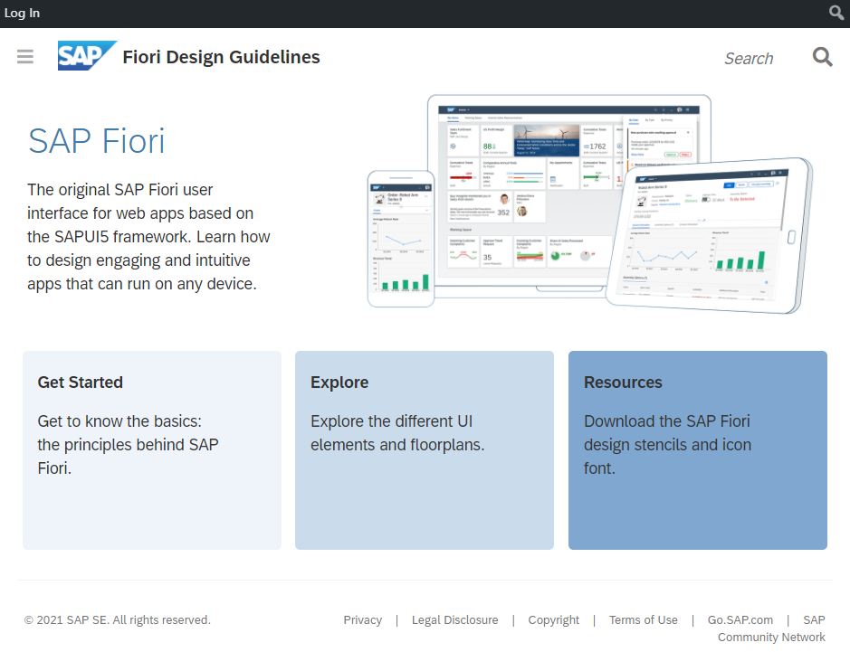

# Overview Fiori Design Guidelines

Most classical SAP GUI business transactions aren't considered to be very user friendly. In contrast to that, users are getting more and more accustomed to intuitive and simple user interfaces in their daily life. This trend was especially driven by touch devices in the last years and leads to the expectation to get similar experiences in business environments.

Therefore, design and usability play major roles when developing Fiori Apps. Every UI5 developer should be interested in creating these beautiful, nicely to use Apps. Following the Fiori Design Guidelines can help to achieve this goal. And for that reason it is recommended to get familiar with these guidelines.

Furthermore, following the guidelines ensures coherence between UI5 Apps delivered by SAP and custom Apps, which is one of the five Fiori design principles (see below for more on that).

But what exactly is Fiori and what is the difference between UI5 and Fiori Apps?

# Fiori, Fiori Apps and UI5 Apps

 Fiori is a design system that describes how Apps should be designed.

 A Fiori App is an App that is designed according to this Fiori design paradigm.

 UI5 is a software framework, which is used to develop Apps. This means that not every UI5 App is a Fiori App at same time. It is possible to build an UI5 App, which violates the Fiori Design Principles. UI5 is usually needed to create a Fiori App, because it includes many elements, which are the technical building blocks of the Fiori design principles.

 Besides dedicated development in UI5, SAP offers another framework to develop Apps according to the Fiori Design Guidelines which is called Fiori Elements. It makes heavy use of annotations and metadata to generate the UI instead of the more development-focused approach of UI5.

This chapter describes some of the basics concepts, when it comes to designing Fiori Apps. For details it is strongly recommended to refer to the official [Fiori Design Guidelines](https://experience.sap.com/fiori-design-web/) published by SAP.

# Design Principles

Fiori is based on the following five design principles which should be considered in any design decision:

- ROLE-BASED
- DELIGHTFUL
- COHERENT
- SIMPLE
- ADAPTIVE

For a detailed definition and description we refer once again to the [Fiori Design Guidelines](https://experience.sap.com/fiori-design-web/design-principles/).

Nevertheless, we would like to highlight the importance of a 'coherent' user experience. In the context of Fiori coherence means that the design, behavior and interaction of different Apps should be consistent.

It is important to ensure that users know what the consequences of their actions are. For example the same icon should be used in all Apps to delete items from a list. Inevitably this means that third-party developers should follow the design of standard SAP applications, because most self-developed UI5 Apps are deployed together with SAP standard applications on the same system.

# Floorplans

An important concept in designing Fiori Apps are Floorplans, which are basically page layouts. Taking a closer look it can be noticed that many SAP Fiori Apps are built according to these Floorplans. The Design Guidelines consider them to be good layout choices for given use cases.

At the moment there are seven Floorplans:

- Analytical List Page
- List Report
- Worklist
- Overview Page
- Object Page
- Initial Page
- Wizard

 For information on their detailed structure and use cases, please check the [Fiori Design Guidelines](https://experience.sap.com/fiori-design-web/). Keep in mind, that each of them has its own layout and should be used for specific use cases. In order to help making a decision on the most fitting layout, the guidelines provide some useful rules in the "When to Use" section of each Floorplan.

# Other Content of the Design Guidelines and their Limitations

A few must-read articles can be found in the section ['General Concepts'](https://experience.sap.com/fiori-design-web/launchpad/). For instance this includes the article ['Action Placement'](https://experience.sap.com/fiori-design-web/action-placement/) on where to place Buttons and other clickable elements. Another interesting example is the chapter ['Message Handling'](https://experience.sap.com/fiori-design-web/messaging/) describing how messages should be displayed.

In the section ['UI Elements'](https://experience.sap.com/fiori-design-web/action-sheet/) single UI5 elements are presented. Recommendations are given when and when not to use them. Furthermore, their behavior and possible interactions are described. This can be very helpful to decide which UI elements are appropriate in a given context.

Of course lots of other interesting articles can be found in the guidelines, which aren't mentioned here because the goal is to provide an overview, not to discuss each and every topic covered by the guidelines.

Concluding, the Fiori Design Guidelines have some gaps and will never be able to answer all design questions. To achieve a company wide uniform App design it is recommend to enhance the official design guidelines with company specific rules. This is especially important, if the guidelines don't provide an answers for a very specific design question.

While creating company specific rules the five design principles should always be taken into account.
