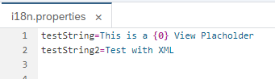

# Advanced Features in i18n

- [Advanced Features in i18n](#advanced-features-in-i18n)
  - [Placeholder in XML Views](#placeholder-in-xml-views)
    - [Usage in 1.69 and above](#usage-in-169-and-above)
    - [Usage in 1.68 and below](#usage-in-168-and-below)
    - [Result](#result)
  - [supportedLocales and fallbackLocale](#supportedlocales-and-fallbacklocale)
  - [`ui5 tooling` tasks](#ui5-tooling-tasks)

## Placeholder in XML Views

It is also possible to use the parameters directly in the XML view.
There are several things to be aware of here.
When [`getText("title", [parameter])`](https://sapui5.hana.ondemand.com/sdk/#/api/module:sap/base/i18n/ResourceBundle%23methods/getText) is called in the controller to the RessourceModel, the method [`sap/base/strings/formatMessage`](https://sapui5.hana.ondemand.com/sdk/#/api/module:sap/base/strings/formatMessage) is used to implement the parameter.
Since formatter can be used in certain UI5 controls, we can use this method in XML view as well.
However, in order to call the method in the control, it must be declared beforehand.

Since version `1.69` this is possible directly in the XML view, before that the declaration must still be made in the controller.
The Documentation for this is found here: [Require Modules in XML View and Fragment](https://sapui5.hana.ondemand.com/#/topic/b11d853a8e784db6b2d210ef57b0f7d7)

### Usage in 1.69 and above

Instead of a custom formatter, the standard `formatMessage` is used here.

The `xmlns="sap.m"` and `xmlns:core="sap.ui.core"` can also be decleared in the mcv:View directly.

```xml
<Title xmlns="sap.m" xmlns:core="sap.ui.core"
  core:require="{ formatMessage: 'sap/base/strings/formatMessage' }"
  text="{
    parts: [
      'i18n>testString',
      'i18n>testString2'
    ],
    formatter: 'formatMessage'
  }"
/>
```

### Usage in 1.68 and below

Here you have to point the formatter to the Controller where you point to the required `formatMessage` module.

```xml
<Title text="{
  parts: [
    'i18n>testString',
    'i18n>testString2'
  ],
  formatter: '.formatMessage'
}"/>
```

```javascript
sap.ui.define([
  "sap/ui/core/mvc/Controller",
  "sap/base/strings/formatMessage",
  // ...
], function(Controller, formatMessage/*, ...*/) {
  "use strict";

  return Controller.extend("...", {
    formatMessage: formatMessage,
    // ...
  });
})
```

### Result

|  |
| :--: |
| *Usage of Placeholder in i18n in XML Views* |

|  |
| :--:  |
| *Screenshot of Placeholder in i18n in XML Views* |

Ressoures:

- [Stackoverflow Comment](https://stackoverflow.com/a/55587775/4743935)
- [Openui5 Issue with Change to use declaration in XML View](https://github.com/SAP/openui5/issues/2475)

## supportedLocales and fallbackLocale

To avoid unwanted requests for unavailable translation files, since **UI5 version 1.77**, you can provide `supportedLocales` and `fallbackLocale` in your app´s `manifest`.

For more information you can look at the official documentation or this awesome blog post:
[UI5 Documentation: Supported Locales and Fallback](https://ui5.sap.com/#/topic/ec753bc539d748f689e3ac814e129563)

[UI5ers Buzz #54: I18n with supportedLocales and fallbackLocale configuration](https://blogs.sap.com/2020/06/03/ui5ers-buzz-54-i18n-with-supportedlocales-and-fallbacklocale-configuration/)

Example from the blog post:

```javascript
{
 "_version": "1.21.0",
 "sap.app": {
  "id": "sap.ui.demo.todo",
  "type": "application",
        "i18n": {
            "bundleUrl": "i18n/i18n.properties",
            "supportedLocales": ["en", "de"],
            "fallbackLocale": "en"
        },
        "title": "{{appTitle}}"
 },
 "sap.ui5": {
  "models": {
   "i18n": {
    "type": "sap.ui.model.resource.ResourceModel",
    "settings": {
     "bundleUrl": "i18n/i18n.properties",
     "supportedLocales": ["en", "de"],
     "fallbackLocale": "en"
    }
   }
  }
 }
}
```

## `ui5 tooling` tasks

At the time of this writing, there are a couple of open source [`ui5-tooling`](https://github.com/SAP/ui5-tooling) tasks available that help with translation/internationlization efforts:

- [`ui5-task-18ncheck`](https://github.com/petermuessig/ui5-ecosystem-showcase/tree/master/packages/ui5-task-i18ncheck): checking for missing translations in `i18n*`-files
- [`ui5-task-translationhub`](https://github.com/DerGuteWolf/ui5-task-translationhub): automated upload, translation and download of `i18n*`-files
