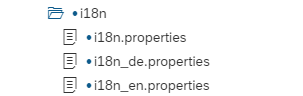

## Overview i18n Overview

Many companies use SAP systems and applications and many different countries.
To ensure easy translation, the "i18n" (Internationalization) process is used.
The app is not always recreated, but only the texts are translated and replaced.

## Language Tags

To identify the individual languages, so-called "Language Tags" are used which are defined by [BCP-47](http://www.iana.org/assignments/language-subtag-registry/language-subtag-registry).
These language tags are stored in the SAP system in table T002 for all stored languages.
These correspond to the ["ISO 639 alpha-2 language code"](https://en.wikipedia.org/wiki/List_of_ISO_639-2_codes). The UI5 application then converts the determined language key into a BCP-47 tag.

As a best practice, it should be defined that the BCP-47 language code
should be kept as short as possible. When creating it, you should
avoid regions, script or subtags as far as possible - unless you add
important and helpful information.

### Good example

- `i18n.properties`
- `i18n_DE.properties`

### Bad example

- `i18n.properties`
- `i18n_DE.properties`
- `i18n_DE_DE.properties`
- `i18n_DE_CH.properties`
- `i18n_DE_AT.properties`

## Files in the UI5 App

The individual translations are stored in the i18n folder with the prefix i18n_ and the corresponding language tag.
In addition, a default file is defined which is automatically called if no language is specified.

|  |
|:--:|
| *UI5 i18n Files and Folder* |

Here are two simple examples, for a German and an English translation.
The "keys" are always identical and will be retrieved later by App based on them. The keys are written in (lower) camelCase.

|  |
| :--: |
| *i18n Simple Example DE File* |

|  |
| :--: |
| *i18n Simple Example EN File* |

It is also possible to connect the i18n keys with a point to get a better overview. You can still use here camelCase.

| |
| :--: |
| *i18n example with dot notation* |

## Annotations in i18n

Annotations in the i18n files are helpful to understand how the i18n texts are used in the app. Annotations are inserted as comments and include a text type classification, an optional length restriction and a freetext explanation.

|  |
| :--: |
| *i18n example with annotations* |

A list of the possible text classification can be found here: [Annotations in Translation Files](https://openui5.hana.ondemand.com/topic/831039835e7c4da3a8a0b49567573afe)
