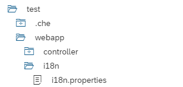

# Usage of i18n in UI5 Apps

In general, the handling of translated texts is very well documented in the SAP documentation:
[Documentation - Walktrough - Step 8: Translatable Texts](https://sapui5.hana.ondemand.com/#/topic/df86bfbeab0645e5b764ffa488ed57dc)

## Setup

 1. create a new folder with the name "i18n
 2. create at least one file with the name "i18n.properties

    The folder should be created in the "webapp" folder

    |  |
    | :--: |
    | *Folder Structure and Init File for i18n* |

 3. configure the manifest.json

    In our manifest.json we have to configure the above created i18n file under models area within UI5 section as shown below. This code is placed in "sap.ui5" --> "models"

    ```javascript
    "i18n": {
            "type": "sap.ui.model.resource.ResourceModel",
            "settings": {
                "bundleName": "your.namespace.i18n.i18n"
            }
    ```

    |  |
    | :--:  |
    | *Folder Structure and Init File for i18n* |

## Usage in XML Views

Since we have defined a model in manifest.json, we access the individual keys in the XML view as with any other model.

The i18n model is referenced first in curly brackets and then the key:
`{i18n>streetNameNumber}`

We take as an example the already previously defined translations

|  |
| :--:  |
| *i18n Simple Example EN File* |

|  |
| :--: |
 |*i18n example XML View* |

## Usage in Controllers

It is good practice to create a BaseController that has several methods already implemented.
One of them is to access the i18n model directly in the controllers:

```javascript
/**
    * Getter for the resource bundle.
    * @public
    * @returns {sap.ui.model.resource.ResourceModel} the resourceModel of the component
*/
getResourceBundle : function () {
    return this.getOwnerComponent().getModel("i18n").getResourceBundle();
}
```

Now it is possible to access the texts in the inherited controllers as follows:

```javascript
var sTitleText = this.getResourceBundle().getText("title");
```

## Usage of placeholders

It is good practice to mark variables in texts with placeholders and not concatenate them directly in JavaScript.

Variables are set in the strings in the i18n.properties files.
Numbers, starting with 0, are placed in curly brackets. In case of multiple variables the numbers are counted up.

|  |
| :--: |
| *Usage of Placeholder in i18n* |

<div class="goodExample"  markdown=1>

### Good example

```javascript
    var sTranslatedText = this.getResourceBundle().getText("worklistTitle", [iCounterVariable]);
```

<br/>
</div>

<div class="badExample"  markdown=1>

### Bad example

```javascript
    var sTranslatedText = this.getResourceBundle().getText("worklistTitlePart1")
                            + ": " 
                            +  iCounterVariable 
                            + this.getResourceBundle().getText("worklistTitlePart2");
```

<br/>
</div>

The use of placeholders directly in XML views is described in [Advanved Features in i18n](/UI5-Best-Practice/i18n/advancedFeatures.html#placeholder-in-xml-views)
