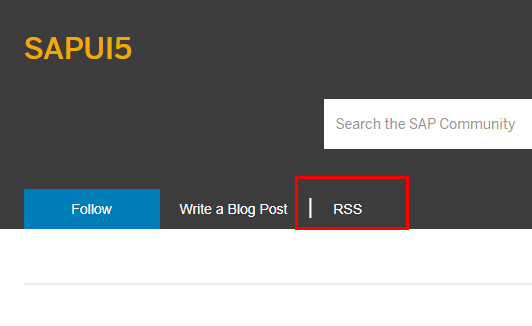

# Overview Ressource Collection

# Official SAP Documents

Here are the most important SAP Documents related to UI5 and Fiori

## UI5 Documentation

Entry point for the most important documents related to UI5 is:

https://ui5.sap.com/

#### Most important Links in this Context

- [Documentation](https://ui5.sap.com/#/topic)
    - [Best Practices for App Developers](https://ui5.sap.com/#/topic/28fcd55b04654977b63dacbee0552712)
- [API Reference](https://ui5.sap.com/#/api)
- [Samples](https://ui5.sap.com/#/controls)
  - [Walkthrough](https://ui5.sap.com/#/entity/sap.m.tutorial.walkthrough)
- [Demo Apps](https://ui5.sap.com/#/demoapps)
  - [Walkthrough](https://ui5.sap.com/test-resources/sap/m/demokit/tutorial/walkthrough/38/webapp/test/mockServer.html?sap-ui-theme=sap_fiori_3)
- [Tools](https://ui5.sap.com/#/tools)
  - [UI5 Tooling](https://github.com/SAP/ui5-tooling)
  - [UI5 Inspector](https://chrome.google.com/webstore/detail/ui5-inspector/bebecogbafbighhaildooiibipcnbngo?hl=en)
  - [Icon Explorer](https://ui5.sap.com/test-resources/sap/m/demokit/iconExplorer/webapp/index.html)

## Fiori Desgin Guidelines

Best Practices in design language for SAP Fiori.
A Complete Overview of most controls with best practice how to implement and "Do´s" and "Dont´s"

[Fiori Desgin Guidelines](https://experience.sap.com/fiori-design-web/)

## SAP Fiori Apps Reference Library

A Overview of all Standard Fiori Apps, including the Product Features and the Implementation Information is found here:

https://fioriappslibrary.hana.ondemand.com/sap/fix/externalViewer/#

The help for this overview is found here: [Fiori Apps Reference Library - User Guide](https://help.sap.com/viewer/187a50cf8191418ab7b52505fcef1789/Ship/en-US/5a8c8240cd43410ea3e3ea6cb901dab7.html)

## SAP Fiori Launchpad

Entry point for all relevant documentation to SAP Fiori Launchpad is this overview:

https://help.sap.com/viewer/product/SAP_FIORI_LAUNCHPAD/EXTERNAL/en-US

# Community

## SAP

An Overview of most SAP Community Ressources are found on the SAPUI5 Topic Page or on the Fiori Page :

[SAP Community Topic SAPUI5](https://community.sap.com/topics/ui5)

[SAP Community Topic Fiori](https://community.sap.com/topics/fiori)

### SAP Answers

All Questions and Answers related to UI5 are found when using the tag "SAPUI5" or "Fiori":

[SAP Answers Tag SAPUI5](https://answers.sap.com/tags/500983881501772639608291559920477)

[SAP Answers Tag Fiori](https://answers.sap.com/tags/73554900100700000977)

[Overview of all Answer Tags](https://answers.sap.com/tags.html)

### SAP Blogs

Same as above, you can use the Tags to find relevant Blog Entries:

[SAP Blogs Tag SAPUI5](https://blogs.sap.com/tags/500983881501772639608291559920477/)

[SAP Blogs Tag SAPUI5](https://blogs.sap.com/tags/73554900100700000977/)

[Overview of all Blog Tags](https://blogs.sap.com/tags/)

#### Extra Tip:

You can use the RSS Feed for every Blog Tag to use in your favourite RSS-Reader (you can also do this for Answers, but that´s maybe a bit silly)

## GitHub

[Official SAP GitHub Repositry](https://github.com/SAP)

[UI5 Community](https://github.com/ui5-community)

[SAP Mentors & Friends](https://github.com/sapmentors)

[Official DSAG GitHub Repository](https://github.com/1DSAG)

[ABAP Open Source Projects](https://dotabap.org/)

